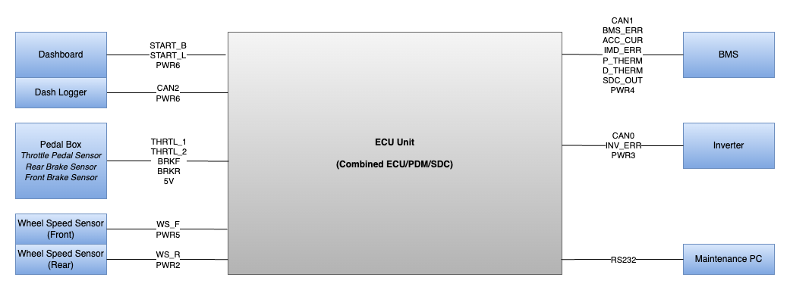
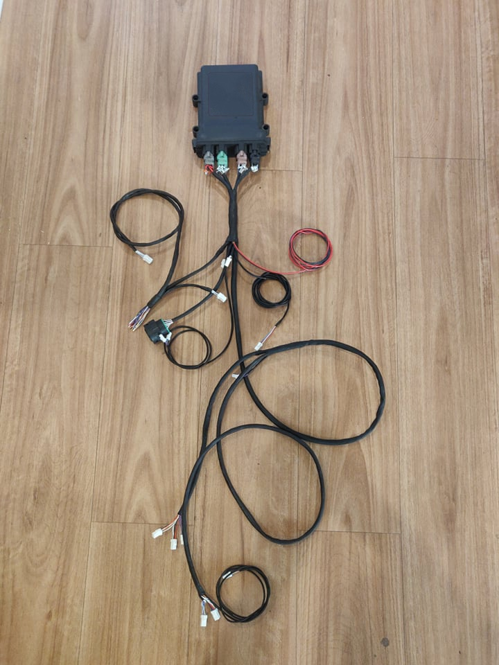
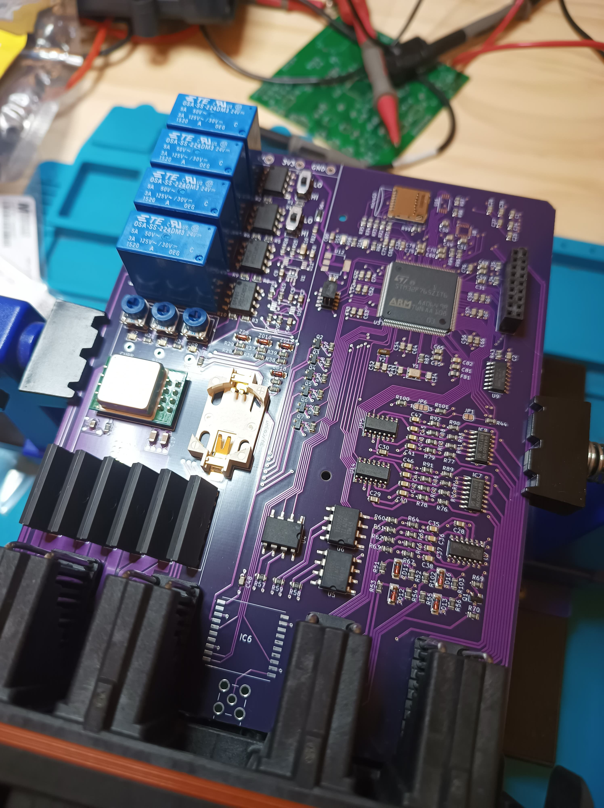

# Custom ECU for Bespoke Electric Vehicles (EVs)

An open source reference hardware and software for building a custom ECU, designed with bespoke EVs in mind.

The ECU design is particularly tailored to FSAE/Formula Student, custom go-karts, and custom hill-climb vehicles.



<p float="left">
  
  
</p>

## Cloning

This project uses submodules. Be sure to fetch submodules when cloning and pulling.

```
git clone <URL> --recurse-submodules
```
or
```
git pull --recurse-submodules
```

## Directory Structure

 * `firmware` Firmware capable of running on the reference hardware.
 * `hardware` Reference hardware design.
 * `tools` Tools used to support operating the ECU.

For more information on sub-components, view the README in the appropriate sub-directory.

## Notes

* The software implementation contains a state machine, fault monitoring, and throttle mapping that may not be suitable for all applications and may need changing before use. These can be found at `firmware/src/vcu/vehicleLogic`.
* The ECU is also designed to be connected to specific inverter and BMS systems (Cascadia Motion Systems and OrionBMS models). 
  * Drivers for these are located at `firmware/src/vcu/device`.
  * The hardware is designed to be flexible around the use of these devices, as they connect via CAN bus and GPIO pins.
  * The vehicle interface software layer (`firmware/src/vcu/vehicleInterface`) is designed to allow the drivers to be easily replaced without requiring re-work of the vehicle logic components.
  * `firmware/src/vcu/startup/initialize.c` dictates what software components are started in run-time.
