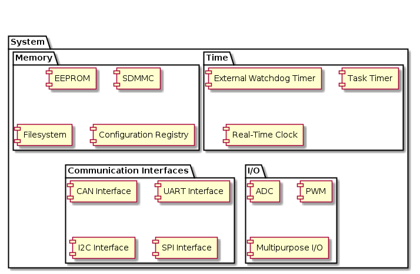

# Hillclimb EV - Common System Firmware Library

## Status

* Under development

## Description

The aim of this repository is to create an abstraction layer above the common low-level STM32 hardware used on the microcontrollers found on the vehicle. This library is used to provide the "System" layer in all of the vehicle's firmware (including the vehicle control unit, inverter, and components' prototypes).

Many abstractions serve to synchronize data into RTOS tasks and queues, where appropriate.

### Dependencies

* STM32 HAL
* FreeRTOS

## Architecture

## Tests
The library is tested via a suite of unit tests contained under `test`. These unit tests leverge the unit testing framework, `Unity`. 

The tests can be executed by invoking the Makefile under the `test` directory.