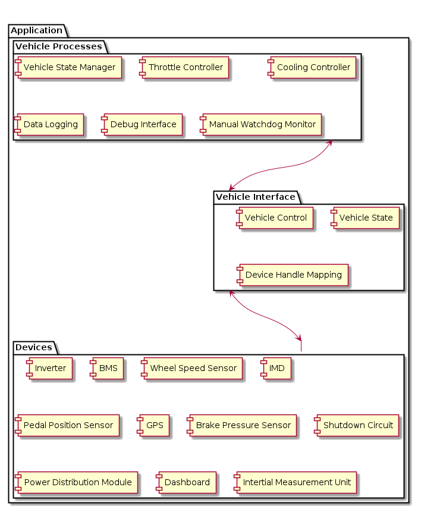
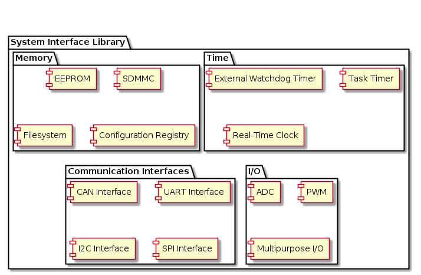

# Hillclimb EV - Vehicle Control Unit firmware

## Description

This repository provides the firmare for Vehicle Control Unit firmware. The Vehicle Control Unit is responsible for overseeing the vehicle state and controlling the vehicle's operation from driver input.

The Vehicle Control Unit implements:
* Vehicle State Machine
* Torque controller (torque mapping to control inverter)
* Fault and safety monitoring
* Drivers for connected devices and sensors:
    * Inverter/motor controller
    * Battery Management System (BMS)
    * Analog sensors (throttle/brake pedals)
    * Wheel speed sensors
    * Dashboard

### Dependencies

* [EV System firmware: `evfirmware-lib`](https://github.com/lflaherty/evfirmware-lib) (in `System/`)
* Third-party:
    * FreeRTOS
    * STM32 HAL
    * Unity (C Unit Test framework)

## Architecture

The software is composed of two primary layers:
* Application
    Provides EV VCU specific functionality which implements the funtionality described above.
* System
    A firmware layer which abstracts the microcontroller services (such as CAN networking or analog inputs).
    This is pulled in from `evfirmware-lib` as a Git submodule.

### Application Layer

The `Vehicle Processes` package implements high level vehicle logic. The `Vehicle Interface` provides a common place to store vehicle data (i.e. physical data) and to provide a controlling interface. The `Devices` implement the device drivers for devices external devices in the vehicle connected to the control unit.

Sensors will publish their data to the `Vehicle Interface`. `Vehicle Processes` will fetch data from here as required. When `Vehicle Processes` is required to command a change to the vehicle (e.g. sending a torque request to the inverter), this is made via the `Vehicle Interface`, which in turn will command the appropriate device driver.

### Layout

### Directory structure

 * `doc` Supporting assets for docs
 * `src`
   * `cube-proj` Main entrypoint, STM32 HAL, firmware build, and STM32CubeIDE project
   * `vcu` Firmware specific to vehicle control unit.
   * `system-lib` Symlink to common MCU firmware.
 * `test` VCU tests (overlayed on top of system-lib tests)

## Tests
The library is tested via a suite of unit tests contained under `test`. These unit tests leverge the unit testing framework, `Unity`. 

The tests can be executed by invoking `run_tests.sh`

Executing the tests will generate a code coverage report using `lcov`.

This will also invoke the unit tests from `evfirmware-lib` (`System/`)