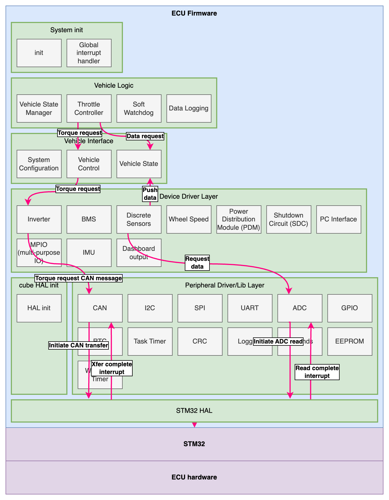

ECU Firmware
============

<h1 id="Description">Description</h1>

The ECU is responsible for overseeing the vehicle state and controlling the vehicle's operation from driver input and operating all devices associated with this process.

The ECU software implements:
* Vehicle logic:
    * Vehicle State Machine
    * Torque controller (torque mapping to control inverter)
    * Fault and safety monitoring
    * Parameter configuration
* Drivers for connected devices and sensors:
    * Inverter/motor controller
    * Battery Management System (BMS)
    * Analog sensors (throttle/brake pedals)
    * Wheel speed sensors
    * Dashboard
* Drivers for peripheral interfaces:
    * Standard interfaces: CAN, I2C, SPI, UART, ADC, GPIO, RTC, CRC
    * Task timer
    * Logging
    * init-time dependency checking
    * EEPROM

<h2 id="Dependencies">Dependencies</h2>

* Third-party:
    * FreeRTOS
    * STM32 HAL
    * Unity (C Unit Test framework)

<h1 id="Table-of-Contents">Table of Contents</h1>

<!-- TOC -->
1. [Description](#Description)
    1. [Dependencies](#Dependencies)
1. [Table of Contents](#Table-of-Contents)
1. [Architecture](#Architecture)
1. [Directory structure](#Directory-structure)
1. [Tests](#Tests)
1. [Software Components](#Software-Components)
    1. [User Journeys - Internal Operation Examples](#User-Journeys---Internal-Operation-Examples)
        1. [Starting vehicle & moving into drive state](#Starting-vehicle---moving-into-drive-state)
        1. [Applying torque from throttle pedal](#Applying-torque-from-throttle-pedal)
    1. [RTOS Tasks and Priorities](#RTOS-Tasks-and-Priorities)
1. [Software Components Detail](#Software-Components-Detail)
    1. [System Init Layer](#System-Init-Layer)
        1. [Init](#Init)
        1. [Global Interrupt Handler](#Global-Interrupt-Handler)
    1. [Vehicle Logic](#Vehicle-Logic)
        1. [Vehicle State Manager](#Vehicle-State-Manager)
            1. [Vehicle State](#Vehicle-State)
            1. [Fault Monitoring](#Fault-Monitoring)
                1. [LV System Faults](#LV-System-Faults)
                1. [Drive Faults](#Drive-Faults)
                1. [Special Faults](#Special-Faults)
        1. [Soft Watchdog](#Soft-Watchdog)
        1. [Throttle Controller](#Throttle-Controller)
        1. [Data Logging](#Data-Logging)
    1. [Vehicle Interface](#Vehicle-Interface)
        1. [System Configuration](#System-Configuration)
        1. [Vehicle Control](#Vehicle-Control)
        1. [Vehicle State](#Vehicle-State)
    1. [Device Driver Layer](#Device-Driver-Layer)
        1. [Inverter](#Inverter)
        1. [BMS](#BMS)
        1. [Discrete Sensors](#Discrete-Sensors)
        1. [Wheel Speed](#Wheel-Speed)
        1. [PC Interface](#PC-Interface)
            1. [Frame Format](#Frame-Format)
            1. [Byte Description](#Byte-Description)
            1. [Address Names](#Address-Names)
            1. [Messages Types](#Messages-Types)
                1. [State Broadcast](#State-Broadcast)
                1. [Log Message](#Log-Message)
                1. [Debug Console Message (PC to ECU)](#Debug-Console-Message-(PC-to-ECU))
        1. [IMU](#IMU)
        1. [Dashboard output](#Dashboard-output)
    1. [Peripheral Driver/Lib Layer](#Peripheral-Driver-Lib-Layer)
        1. [CAN](#CAN)
        1. [I2C](#I2C)
        1. [SPI](#SPI)
        1. [UART](#UART)
        1. [ADC](#ADC)
        1. [GPIO](#GPIO)
        1. [RTC](#RTC)
        1. [Task Timer](#Task-Timer)
        1. [CRC](#CRC)
        1. [Logging](#Logging)
        1. [Depends](#Depends)
        1. [EEPROM](#EEPROM)
    1. [STM32 HAL](#STM32-HAL)
<!-- END_TOC -->

<h1 id="Architecture">Architecture</h1>

The firmware is comprised of the following layers:

1. __Vehicle Logic__  
Implements vehicle behavior including state management and vehicle controls.
2. __Vehicle Interface__  
Interfacing layer between the vehicle logic and device drivers.  
Device drivers will push data to the vehicle state, which can be pulled by vehicle logic processes. Conversely, vehicle logic processes can control the vehicle in a driver agonstic manner by using the vehicle interface layer. The vehicle interface layer will hide the driver details from the logic layer.
3. __Device Drivers__  
Implements drivers for off-board devices (e.g. inverter, wheel speed), and on-board ECU specific devices (e.g. IMU, GPS, but _not_ peripherals such as CAN or SPI). These are ECU/vehicle specific devices.
4. __Peripheral Drivers__  
Implements interfaces to common STM32 peripherals. These drivers interface to the FreeRTOS scheduling enviornment, but are otherwise agnostic to the vehicle related purpose of the ECU, and can act as generalist library. The main purpose of many of these are to provide a thread-safe manner of queueing instructions to lower level peripherals, and handling interrupts where a peripheral may be used by several _device drivers_.
5. __STM32 HAL__  
Standard HAL package provided by ST Micro.

Visualized:

  

<h1 id="Directory-structure">Directory structure</h1>

 * `doc` Supporting assets for docs
 * `src`
   * `cube-proj` Main entrypoint, STM32 HAL, firmware build, and STM32CubeIDE project
   * `vcu` Firmware specific to vehicle control unit.
   * `system-lib` Symlink to common MCU firmware.
 * `test` VCU tests (overlayed on top of system-lib tests)

<h1 id="Tests">Tests</h1>

The library is tested via a suite of unit tests contained under `test`. These unit tests leverge the unit testing framework, `Unity`. 

The tests can be executed by invoking `run_tests.sh`

Executing the tests will generate a code coverage report using `lcov`.

This will also invoke the unit tests from `evfirmware-lib` (`System/`)

<h1 id="Software-Components">Software Components</h1>

Expanding on the high level firmware stack from above, we can see all the software components:

  

<h2 id="User-Journeys---Internal-Operation-Examples">User Journeys - Internal Operation Examples</h2>

To visualize the flow of data through this system, we can consider a few examples:

<h3 id="Starting-vehicle---moving-into-drive-state">Starting vehicle & moving into drive state</h3>

The driver will:
1. Turn power on
2. Press brake, then simultaneously press dashboard button

The ECU firmware will, internally:

1. Power on
    1. Upon powering on, the init code will initialize all code modules.
    2. Devices will report their status to the _vehicle state_ module.
    3. The _vehicle state manager_ will query these fields until it is satisfied that the vehicle is in an idle, ready, and non fault state.
    4. When it transitions to this ready state, it instructs the _vehicle control_ module to flash in a manner that indicates this state.
    5. The _vehicle control_ module relays this requrest to the _dashboard output_.
    6. The state machine should be in the correct state now, and the driver is shown this state.
2. Driver moves vehicle into drive
    1. The driver physically presses the brake and dashboard button.
    2. At a specific polling period, the _discrete sensors_ module is recording the ADC measurements from the brake sensor ADC input, and the dashboard button input. These measurements are regularly being updated in the _vehicle state_.
    3. Simultaneously, the _vehicle state manager_ is monitoring _vehicle state_ for these fields. If the brake pressure is appropriately high, and the dashboard button has been simultaneously pressed, the _vehicle state manager_ will move through it's drive train power on process (more details in the _vehicle state manager_ doc), and if successful, will transition to the drive state. While transitioning, it instructs the _vehicle control_ module on what it needs the drive train to be doing.
    4. Once in the drive state, the _vehicle state manager_ will instruct the _vehicle control_ module to indicate on the dashboard that the car is in drive. This invokes a method in _dashboard output_ to update the indicator LED.

<h3 id="Applying-torque-from-throttle-pedal">Applying torque from throttle pedal</h3>

Once the driver puts the vehicle into it's drive state (as above), then pressing the accelerator should apply power to the wheels.

The process internal to the ECU:

* At a regular periodic interval, the _discrete sense_ module will sample all of the ADC input sensors, including the throttle pedal sensors.
    * The sensor values are averaged. If no fault condition is found (i.e. the sensors disagree), the _discrete sense_ module will push the latest sensor value to the _vehicle state_ module.
* Simultaneously, the _vehicle control_ state will:
    1. Periodically (the task nominally runs at 100Hz/10ms) request the latest throttle sensor value. The _vehicle control_ task and sensor tasks run at the same rate. The sensors have a higher priority, so the RTOS should execute sensors first. The sensor field in _vehicle state_ is protected via a mutex.
    2. With the latest throttle sensor value, the _throttle control_ module applies a torque mapping, converting the pedal depression percentage to a requested inverter torque in Nm.
    3. The _throttle control_ module invokes the _vehicle contorl_ module to apply this value of Nm to the drive train.
    4. The _vehicle control_ will then invoke the inverter driver to send a request for this value of torque.
    5. The inverter driver constructs a CAN bus message for the requested torque output, and sends it.
* Simultaneously, the _vehicle state manager_ is monitoring the vehicle state for any fault conditions or requested state changes.

To visualize this flow of data needed by the _vehicle control_ module:

  

<h2 id="RTOS-Tasks-and-Priorities">RTOS Tasks and Priorities</h2>

The modules with RTOS tasks are arranged into the following priorities.

The RTOS (FreeRTOS) uses preemption and task priorities, and round robin scheduling for equal priorities.
Only modules that have RTOS tasks are shown here. The remaining drivers are invoked within an existing task context.

  

The priorities are selected to achieve:
* Initialization is performed first, and at a higher priority than any other tasks that are started during init.  
This requires the init task to have the highest priority.
* We want the latest sensor data available for the logical tasks. This gives us the desire to have `Prio(RT critical sensors) > Prio(RT critical logic)`.
* We want real-time critical processes to have a high priority. The system performs RT critical work (i.e. driving the vehicle) alongside non-RT critical work (i.e. logging, or checking the PC interface). The RT critical work should always be performed ahead of other work, and non-RT critical work can fill the idle time in-between (most RT critical work is done at 10ms intervals, so the time after RT work has completed until the next 10ms step is available).
* The purpose of the soft watchdog is to capture a fault or hang in a critical task. All critical tasks regularly report to the soft watchdog. It is desirable to place the watchdog task as `Prio(soft watchdog) > Prio(all RT critical code)` such that:
    * Upon correct operation, the watchdog runs nominally in line with RT critical code.
    * Upon a single task having a fault where it hangs, the scheduler will context switch to the soft watchdog, whose internal counter will identify a fault.
    * If the fault causes the entire system (including scheduler) to lock up, the hardware watchdog will take over.
* Non RT critical tasks can be arranged on lower priorities.
    * Non RT critical sensors (useful for log data) are put on a higher priority than the log task for the same reason as above with the RT critical sensors/logic.

These priorities, in conjunction with the scheduler, enact the following de facto state machine:

  

This state machine is not explicitly coded as a state machine in the source, it is deliberate emergent behavior of the scheduler.

All critical logic registers with the watchdog handler.
The watchdog handler will trigger a system fault if any critical logic is not handled in a timely manner.

<h1 id="Software-Components-Detail">Software Components Detail</h1>

<h2 id="System-Init-Layer">System Init Layer</h2>

<h3 id="Init">Init</h3>

As the name suggests, this module is responsible for calling the init method of all other required modules in the system, and doing so in the correct order.

The init module maintains local ownership of the data structures required for all devices. It does not expose them in the global context.

The init module will create an init task, where all initialization methods are invoked from. Many init methods (for other modules) will create further RTOS tasks. Upon init completion, the init task will be deleted, however the data storage will remain.

<h3 id="Global-Interrupt-Handler">Global Interrupt Handler</h3>

This is really a sub-component of the init module, but broken out explicitly for clairty. Certain higher level drivers require some code to run from an interrupt handler. In some instances, the timing and frequency of these events would prohibit this from being done via RTOS task notifications (for example, the wheel speed sensors may run at several kHz, but perform very simple code for each ISR routine). The global interrupt handler simply implements the ISR routine, and calls each module's ISR as needed.

<h2 id="Vehicle-Logic">Vehicle Logic</h2>

<h3 id="Vehicle-State-Manager">Vehicle State Manager</h3>

The _Vehicle State Manager_ is responsible for two tasks:
* Managing the vehicle state
* Monitoring fault conditions (and handling them)

<h4 id="Vehicle-State">Vehicle State</h4>

  

The state diagram essentially follows:
1. Power up and wait for external devices to power up/become ready.
2. At user request, engage HV system and wait for HV to become ready.
3. Switch between driving states at user request.
4. Or enter fault state from any of the above if a fault is observed.

As noted in the diagram, there is no reverse drive state due to hill-climb/FSAE/etc vehicles having no rear visibility & no need to move in reverse.

<h4 id="Fault-Monitoring">Fault Monitoring</h4>

Faults are split into two categories: Drive Faults and LV System Faults.
* Drive faults will always invoke a transition to the fault state, regardless of origin state. 
* LV System faults will only invoke a transition to the fault state only from the `LV ready` state and onwards. Earlier during init (i.e. `LV startup` state), it is assumed that the LV systems may be in unsable states as they are initializing. After `LV startup`, all critical systems must remain in a known good state.

All faults are encoded into an error value. They are encoded as a binary one-hot system (i.e. individual faults are all a power of 2) such that multiple errors can be expressed as a logical OR of their individual error codes. Fault codes are encoded as a 32-bit word. LV System Faults occupy the lower 8 bits and Drive Faults oppupy top 24 bits.

<h5 id="LV-System-Faults">LV System Faults</h5>

| Component | Fault Condition | Configuration | Error Value | Notes |
| --------- | --------------- | ------------- | ----------- | ----- |
| Inverter/motor | CAN message timeout | Timeout period configurable | 0x00000001 | |
| BMS | CAN message timeout | Timeout period configurable | 0x00000002 | |
| Inverter | Inverter state is unexpected | | 0x00000004 | This code is only generated when the vehicle state is _LV Startup_. An unexpected inverter state from any other vehicle state would be error `0x01000000`. |
| Soft Watchdog Timeout | The soft watchdog task indicates a critical task is hung (not vehicle state manager) | | 0x00000008 | A fault in the vehicle state manager is handled as a special fault (described in [Special Faults](#Special-Faults)). |

<h5 id="Drive-Faults">Drive Faults</h5>

| Component | Fault Condition | Configuration | Error Value | Notes |
| --------- | --------------- | ------------- | ----------- | ----- |
| Accelerator Pedal | Outside of calibrated range | Calibration of pedal can be configured | 0x00000100 | A failure mode of a disconnected sensor would be handled here. |
| Accelerator Pedal | Redundant sensors disagree | Disagreement tolerance can be configured | 0x00000200 |  |
| Brake Pedal | Outside of calibrated range | Calibration of pedal can be configured | 0x00000400 | A failure mode of a disconnected sensor would be handled here. |
| Brake Pedal | Redundant sensors disagree | Disagreement tolerance can be configured | 0x00000800 |  |
| Brake Pedal | Accel/brake pedal abuse (both pedals simultaneously pressed) | Can be disabled | 0x00001000 |  |
| BMS | Any cell above temperature threshold | Limit configurable | 0x00002000 |  |
| BMS | Current draw too high | Limit configurable | 0x00004000 |  |
| BMS | Any cell above threshold voltage | Limit configurable | 0x00008000 |  |
| BMS | State of charge too low | Limit configurable | 0x00010000 |  |
| BMS | BMS fault indicator |  | 0x00020000 |  |
| Inverter/motor | Inverter internal temperature too high | Limit configurable | 0x00040000 |  |
| Inverter/motor | IGBTs above allowable temp | Limit configurable | 0x00080000 | Thermal throttling could be considered before this occurs (not currently implemented) |
| Inverter/motor | Motor above allowable temp | Limit configurable | 0x00100000 | Thermal throttling could be considered before this occurs (not currently implemented) |
| Inverter/motor | Current draw too high | Limit configurable | 0x00200000 |  |
| Inverter/motor | Inverter fault indicator |  | 0x00400000 |  |
| Inverter/motor | Inverter fault message |  | 0x00800000 |  |
| Inverter/motor | Inverter state is unexpected |  | 0x01000000 | This would result in a `0x00000004` if it occurs during the _LV Startup_ vehicle state. |

<h5 id="Special-Faults">Special Faults</h5>

A number of scenarios require more extreme management of a fault:
* A CPU fault  
_The code is configured to handle CPU faults (with a custom CPU hard fault handler)._
* A hardware watchdog timeout  
_There is a hardware watchdog in use in addition to the soft watchdog._  
_The hard watchdog will catch more extreme system hangs where the soft watchdog or RTOS scheduler has hung_
* A microcontroller brown-out
* The vehicle state manager has transitioned into a fault state, but peripherals indicate that they are still in fault state
* A soft watchdog has been triggered, but the vehicle state manager has not transitioned to it's fault state.

If these occur, the firmware will immeidately run a special fault handler where it moves the vehicle into a safe state by:
* Powering off inverter power channel
* Enabling the ECU fault output (this will open the SDC relays)
* Apply a solid LED output to indicate that the ECU is stuck
* Hold in an infite loop - we no longer proceeed past this point.

These operations are done with as little firmware layers as possible - they will write directly to hardware (i.e. they bypass the `Vehicle Control` component, and the drivers below this, as it is likely unclear what has caused this fault).

<h3 id="Soft-Watchdog">Soft Watchdog</h3>

The soft watchdog is an indepent RTOS task where, during init, other critical tasks will register to the soft watchdog. During runtime, these critical tasks must "feed" the watchdog (just call a notification task to reset their respective counters). The watchdog will count how long it has been since a feed from each critical task. If the count exceeds a timeout, it will update a flag in the _vehicle state_, where the _state machine manager_ component will read this and act accordingly.

The soft watchdog will monitor the vehicle state. If a fault state is not entered within a small amount of time, the special fault handler will be invoked.

The soft watchdog task is also responsible for feeding the hardware watchdog. The soft watchdog should be able to account for all faults that don't prevent the task from running, which is where the hardware watchdog will take over (and run the special fault handler).

<h3 id="Throttle-Controller">Throttle Controller</h3>

This module will read the throttle pedal sensor value, translate this via a torque map to a request of Nm, and requests this from the inverter. This operation (or whether the module sits idle) is controlled via the API, and is called by the vehicle state manager.

The module contains a torque map. The exact torque value is found by linearly interpolating between entries of the torque map.

The torque map implemented is:
| Accelerator pedal % | Torque (Nm) |
| ------------------- | ------------------- |
| 0% | 0 Nm |
| 10% | 0 Nm |
| 50% | 100 Nm |
| 70% | 200 Nm |
| 100% | 500 Nm |

  

* The configured torque is based on a motor with a maximum torque of 500 Nm.
* A deadzone of 0 Nm is created between 0 and 10% pedal depression. To account for very light movement and ADC noise, a deadzone is applied.
* To allow for more precise control at slower speeds, the output torque up to 50% pressed is fairly limited.
* If the driver wants to accelerate rapidly, the torque increases rapidly after this point.

Single pedal driving and regenerative braking are currently not supported. Only mechanical braking is supported.

Any regenerative braking would be added to this module, however.

<h3 id="Data-Logging">Data Logging</h3>

The data logging module simply makes a copy of system state and logs it to a file on the SDMMC at on a regular periodic interval.

<h2 id="Vehicle-Interface">Vehicle Interface</h2>
<h3 id="System-Configuration">System Configuration</h3>

The system configuration is a table of values used by the rest of the system during init. The table is populated by fields stored on the extermal EEPROM.

Configuration options include the pedal calibration, or fault timeout periods. The full list of configurations are available in `firmware/src/vcu/vehicleInterface/config/configData.h`.

Configuration values are stored on the 256Kbit (32KiB) EEPROM. To simplify development and modification, the external EEPROM is loaded with an instance of littlefs. The configuration items are stored as files under `/config/`. Their paths represent the field values and the file contents are the configuration value. Each file has a corresponding `*.crc32` checksum file.

E.g. for the calibration of accelerator pedal sensor A, the files are:
* `/config/inputs/accelPedal/calibrationA/rawLower` Raw ADC value corresponding to the pedal being 0% pressed.
* `/config/inputs/accelPedal/calibrationA/rawLower.crc32` 32-bit CRC of `rawLower`
* `/config/inputs/accelPedal/calibrationA/rawUpper` Raw ADC value corresponding to the pedal being fully pressed.
* `/config/inputs/accelPedal/calibrationA/rawUpper.crc32` 32-bit CRC of `rawUpper`

The PC interface can also query and update the values on the EEPROM, but they are only loaded into the _system configuration_ module at startup.

<h3 id="Vehicle-Control">Vehicle Control</h3>

The _Vehicle Control_ module is really just a shim. It contains APIs that allow control over any aspect of the car. Internally, it will just invoke one of the device drivers to achieve the requested funtionality.

Current operations supported:
* Enable inverter
* Disable inverter
* Request motor torque - set torque in Nm and motion direction
* Set power channel - set power channel number and enable/disable
* Set ECU error - set to enabled or disabled
* Set dash LED output - set to on or off

<h3 id="Vehicle-State">Vehicle State</h3>

The _vehicle state_ module holds the current physical state of the car and owns the sychronization primitives controlling thread-safe access to these variables.

You can safely copy the state by invoking `VehicleState_CopyState`. Alternatively, individual elements can be accessed by using `VehicleState_AccessAcquire` and then reading or writing values. `VehicleState_AccessRelease` must always be used after a successful acquire.

The vehicle state is conceuptialized as a tree, and currently contains:

* Input sensors
    * Averaged accelerator input [0.0 - 1.1]
    * Accelerator A input [0.0 - 1.1]
    * Accelerator B input [0.0 - 1.1]
    * Accelerator A raw ADC reading
    * Accelerator B raw ADC reading
    * Accelerator valid [bool]
* Dash inputs
    * Dash button pressed [bool]
* Vehicle sensors
    * GPS
        * UTC Time
        * Latitude
        * Longitude
        * Position fix?
        * Number of satellites
    * SDC
        * BMS fault state [bool, true = fault condition]
        * BSPD fault state
        * IMD fault state
        * ECU fault output active
    * Wheel speed
        * Wheel speed front (RPM)
        * Wheel speed rear (RPM)
        * Wheel speed front count
        * Wheel speed rear count
* GLV state
    * PDM channel state 1-8 [bool, true = power enabled]
* Battery state
    * Maximum cell voltage [Volts]
    * Maximum cell voltage - Cell ID
    * Maximum cell temperature [Celsius]
    * Maximum cell temperature - Cell ID
    * Minimum cell voltage [Volts]
    * Minimum cell voltage - Cell ID
    * Minimum cell temperature [Celsius]
    * Minimum cell temperature - Cell ID
    * DC Current [Amps]
    * DC Voltage [Volts]
    * BMS Fault indicator [bool]
    * BMS number of populated cells
    * BMS message counter
    * BMS failsafe status
* Motor
    * Temperature [Celsius]
    * Angle [Degrees]
    * Speed [rpm]
    * Phase A current [Amps]
    * Phase B current [Amps]
    * Phase C current [Amps]
    * Calculated torque [Nm]
* Inverter
    * Module A temperature [Celsius]
    * Module B temperature [Celsius]
    * Module C temperature [Celsius]
    * Gate driver temperature [Celsius]
    * Control board temperature [Celsius]
    * Output frequency [Hz]
    * DC bus current [Amps]
    * DC bus voltage [Amps]
    * Output voltage [Line-neutral voltage]
    * D-axis voltage [Volts]
    * Q-axis voltage [Volts]
    * Commanded flux [Wb]
    * Feedback flux [Wb]
    * D-axis current feedback [Amps]
    * Q-axis current feedback [Amps]
    * D-axis commanded current [Amps]
    * Q-axis commanded current [Amps]
    * Commanded torque [Nm]
    * Modulation index
    * Flux weakening output [Amps]
    * Inverter VSM state
    * Inverter state
    * Discharge state
    * Inverter enabled [bool]
    * Motion direction
    * Timer counts (incremented every 3ms)
    * Run faults (inverter fault codes)
    * Post fault (inverter fault codes)

<h2 id="Device-Driver-Layer">Device Driver Layer</h2>
<h3 id="Inverter">Inverter</h3>

This module will handle CAN bus messages from the inverter, updating the state machine, and will construct CAN bus messages to send to the inverter based on the driver API.

The inverter driver is based a Cascadia Motion Sytems CM200 inverter.

<h3 id="BMS">BMS</h3>

This module will handle CAN bus messages from the inverter, updating the state machine.

The BMS driver is based on an OrionBMS 2 with the following CAN message configuration:

| CAN ID | Message Name | Frequency | Data[0] | Data[1] | Data[2] | Data[3] | Data[4] | Data[5] | Data[6] | Data[7] |
| ------ | ------------ | --------- | ------- | ------- | ------- | ------- | ------- | ------- | ------- | ------- |
| 0x301 | Max cell state | 100 Hz | Max cell temperature LSB | Max cell temperature MSB | Max temperature cell ID | Max cell voltage LSB | Max cell voltage MSB | Max voltage cell ID | 0 | 0 |
| 0x302 | Min cell state | 100 Hz | Min cell temperature LSB | Min cell temperature MSB | Min temperature cell ID | Min cell voltage LSB | Min cell voltage MSB | Min voltage cell ID | 0 | 0 |
| 0x303 | Pack state | 100 Hz | DC current LSB | DC current MSB | Bus voltage LSB | Bus voltage MSB | State of charge LSB | State of charge MSB | 0 | 0 |
| 0x304 | Status | 100 Hz | Counter | Populated Cells | Failsafe status LSB | Failsafe status MSB | 0 | 0 | 0 | 0 |

All fields size >1 byte are sent LSB first.

**Data Formats**:
| Field | Data Type | Encoding | Range | Notes |
| ----- | --------- | -------- | ----- | ----- |
| Temperature | int16 | Temperature in degrees C x10 | -3276.8 °C to +3276.7 °C | |
| Cell Voltage | int16 | Voltage in Volts x100 | -327.68 V to +327.67 V | |
| Cell ID | uint8 | Raw cell number | 0 to 255 | |
| Pack Current | int16 | Current in Amps x10 | -3276.8 A to +3276.7 A | |
| Pack Voltage | int16 | Current in Volts x10 | -3276.8 V to +3276.7 V | |
| State of charge | uint16 | Percentage x100 | 0% to 655.35% | |
| Counter | uint8 | Raw value | 0 to 255 | Increments for every message |

<h3 id="Discrete-Sensors">Discrete Sensors</h3>

This module perodically reads discrete sensors (GPIO inputs and ADC inputs) and pushes the results to the vehicle state.

This module currently handles:
* Accelerator pedal A
* Accelerator pedal B
* Average accelerator pedal
* Brake pressure front
* Brake pressure rear
* Bashboard button

The module updates these values on a regular 100Hz update tick.

<h3 id="Wheel-Speed">Wheel Speed</h3>

The wheel speed sensor measures the speed of a hall effect wheel speed sensor. The sensor driver assumes that the spacing of the teeth is uniform, and that the high/low size of the sensor teeth are equal. The number of teeth is configurable at init. The sensor will produce a new reading every 1 second.

The voltage input appears as a PWM signal. The frequency of the PWM signal encodes the wheel speed.

The module implements an ISR (that is invoked by the [Global Interrupt Handler](#Global-Interrupt-Handler)). This does a GPIO read on the wheel speed sensor hall effect inputs, and then pushes these values to an RTOS queue. In the main task, the driver pulls these readings off, and calculates the number of 0V -> 24V transitions over the 1s period, informing a simple conversion to RPM.

<h3 id="Power-Distribution-Module-(PDM)">Power Distribution Module (PDM)</h3>

This module is simply an abstraction to access the correct GPIO pins to control the 24V power output channels. When updating a power channel, the module will also reflect the change in the [Vehicle State](#Vehicle-State) module.

<h3 id="Shutdown-Circuit-(SDC)">Shutdown Circuit (SDC)</h3>

The module serves two purposes:
* A simple abstraction to access the ECU error output
* Update the [Vehicle State](#Vehicle-State) when any of the SDC error inputs (BMS error, IMD error, SDC error) is asserted.

The [Global Interrupt Handler](#Global-Interrupt-Handler) invokes the SDC ISR method when the GPIO interrupt is triggered. The SDC ISR method will read the state of all the SDC inputs via a simple GPIO read. If any errors are asserted, a FreeRTOS task notification is used to awake the SDC task, finally updating the field in the [Vehicle State](#Vehicle-State).

<h3 id="PC-Interface">PC Interface</h3>

The PC interface implements the serial (RS232) interface to a debug/control computer.

The following functions can currently be performed over the interface:
* Sending ECU log messages
* Sending ECU state updates
* Debug terminal

The serial interface communication is performed via a Modbus protocol. This allows the debug PC to multiplex the different types of data and handle independent operations. It also allows easier expansion of the PC interface.

<h4 id="Frame-Format">Frame Format</h4>

Words are transmitted MSB first.

The console is configured to 115200 bps.

| Byte | Content |
| ---- | ------- |
| 0 | Start |
| 1 | Address[1] |
| 2 | Address[0] |
| 3 | Function[1] |
| 4 | Function[0] |
| 5 .. 5+(n-1) | Data[n..0] |
| 6+(n-1) | CRC[3] |
| 7+(n-1) | CRC[2] |
| 8+(n-1) | CRC[1] |
| 9+(n-1) | CRC[0] |
| 10+(n-1) | End[1] |
| 11+(n-1) | End[0] |

<h4 id="Byte-Description">Byte Description</h4>

| Section | Length (Bytes) | Description |
| ------- | -------------- | ----------- |
| Start | 1 | Payload begin. Equal to 0x80 |
| Address | 2 | Address of receiver |
| Function | 2 | Message type |
| Data | n | Message data |
| CRC | 4 | 32-bit cyclic redundancy check |
| End | 2 | Frame end. Equal to <CR><LF> |

<h4 id="Address-Names">Address Names</h4>

| Address | Target |
| ------- | ------ |
| 0x01 | ECU |
| 0x02 | Debug PC |

<h4 id="Messages-Types">Messages Types</h4>

<h5 id="State-Broadcast">State Broadcast</h5>

| | |
| - | - |
| Message Name | State Broadbast |
| Function | 0x01 |
| Transmit Rate | 1Hz per data field |
| Send Address | 0x01 |
| Target Address | 0x02 |
| Data Length | 7 |
| Message Length | 18 |
| Description | Transmit live vehicle data from the [Vehicle Interface](#Vehicle-Interface) layer. |

| Data[0] | Data[1] | Data[2] | Data[3] | Data[4] | Data[5] | Data[6] |
| ------- | ------- | ------- | ------- | ------- | ------- | ------- |
| FieldID[1] | FieldID[0] | FieldSize | Data[3] | Data[2] | Data[1] | Data[0] |

* `FieldID` ID of field. IDs are located at `firmware/src/vcu/device/pcinterface/fieldId.h`.
* `FieldSize` size of `Data` (bytes).
* `Data[3..0]` latest contents of field.

<h5 id="Log-Message">Log Message</h5>

| | |
| - | - |
| Message Name | Log Message |
| Function | 0x02 |
| Transmit Rate | Variable (upon ECU log event) |
| Send Address | 0x01 |
| Target Address | 0x02 |
| Data Length | 32 |
| Message Length | 43 |
| Description | Continuously dumps print/log messages. Transmits up to 32 bytes at once - no more to avoid data corruption. Unused bytes are left as zeros and are ignored. Note that this message _could_ be read with an incorect CRC when displaying output as it just contains ASCII text. |

| Data[0..31]|
| ------- |
| LogChar[0..31] |

* `LogChar` ASCII byte

<h5 id="Debug-Console-Message-(PC-to-ECU)">Debug Console Message (PC to ECU)</h5>

| | |
| - | - |
| Message Name | Debug Message (ECU -> PC) |
| Function | 0x09 |
| Transmit Rate | Variable (upon response generated) |
| Send Address | 0x02 |
| Target Address | 0x01 |
| Data Length | 8 |
| Message Length | 17 |
| Description | Transmits a text command to the ECU. For help with the debug terminal, issue the command `help`. View more details at `firmware/src/vcu/device/pcinterface/debugtermcommands.c`. |

| Data[0..7]|
| ------- |
| CmdStr[0..7] |

* `CmdStr` String to append to the internal command buffer.

#### Debug Console Message (ECU -> PC)

This message ID is currently TBD. The current implementation prints log messages when handling debug console requests.

<h3 id="Multi-purpose-IO-(MPIO)">Multi-purpose IO (MPIO)</h3>

Implements a simple wrapper around the multi-purpose IO components on the ECU board. Allows an ADC read operation, or simple GPIO read/write.

The module will set the output mode pin. As with the ADC/GPIO drivers, the STM32-specific pin configuration is done seperately.

<h3 id="IMU">IMU</h3>

TODO

<h3 id="Dashboard-output">Dashboard output</h3>

TODO

<h2 id="Peripheral-Driver-Lib-Layer">Peripheral Driver/Lib Layer</h2>
<h3 id="CAN">CAN</h3>

TODO

<h3 id="I2C">I2C</h3>

TODO

<h3 id="SPI">SPI</h3>

TODO

<h3 id="UART">UART</h3>

TODO

<h3 id="ADC">ADC</h3>

TODO

<h3 id="GPIO">GPIO</h3>

TODO

<h3 id="RTC">RTC</h3>

TODO

<h3 id="Task-Timer">Task Timer</h3>

TODO

<h3 id="CRC">CRC</h3>

TODO

<h3 id="Logging">Logging</h3>

TODO

<h3 id="Depends">Depends</h3>

TODO

<h3 id="EEPROM">EEPROM</h3>

TODO

<h2 id="STM32-HAL">STM32 HAL</h2>

The STM32 HAL is simply the ST Micro provided HAL for the STM32 F7 microcontroller.
