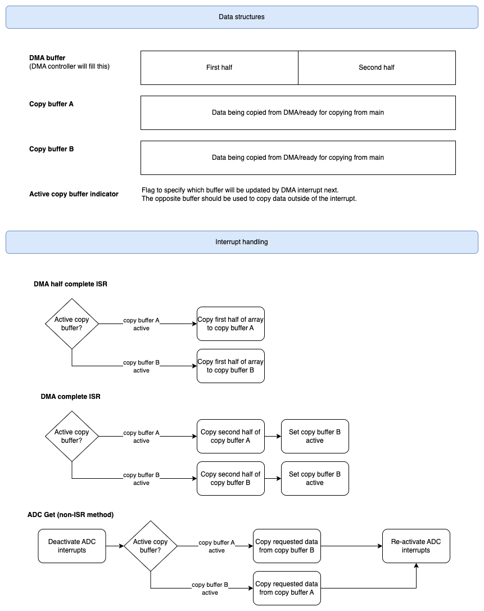

# ADC Interface
## Summary
The implementation of the ADC interface provides an abstraction of the ADC peripheral, handling the interrupt methods, and employing DMA.

The implementation utilizes a "triple buffer" to receive data via DMA. One buffer directly controlled via DMA. DMA is operated in "continuous" mode, so a first and second half buffer are required, and DMA will provide half complete and full complete interrupt. This provides the opportunity to copy data out of the DMA-controlled buffer before the DMA controller overwrites it. The remaining two buffers are used as a means to copy out data while asynchronously being able to query the ADC using the public API (`ADC_Get()`). The active buffer can be copied to (at any random time, via an ISR), and the other buffer can be read from in `ADC_Get()`. The active buffer swaps when the full copy is complete.

The `ADC_Get()` method must momentarily disable the DMA interrupts to prevent the active buffer signal from being updated (and/or subsequently the data itself) before the method is complete.

In terms of latency, the `ADC_Get()` method will always have access to the latest data. The buffer that this method reads from is always the latest copy, as the DMA complete ISR will allow reading from this buffer first.

