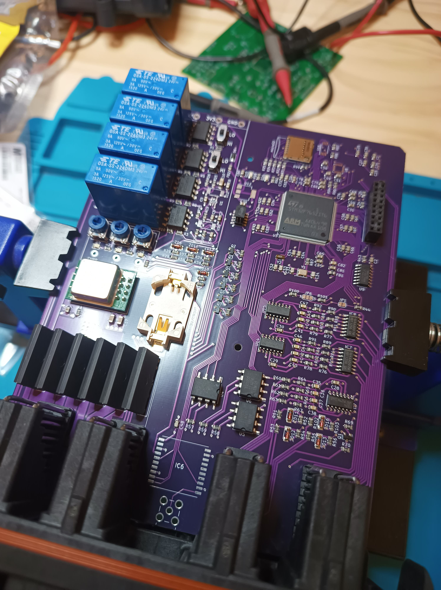
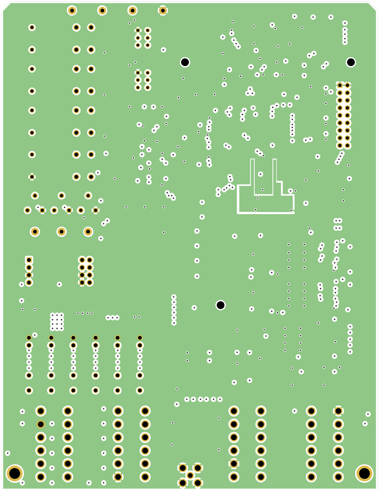
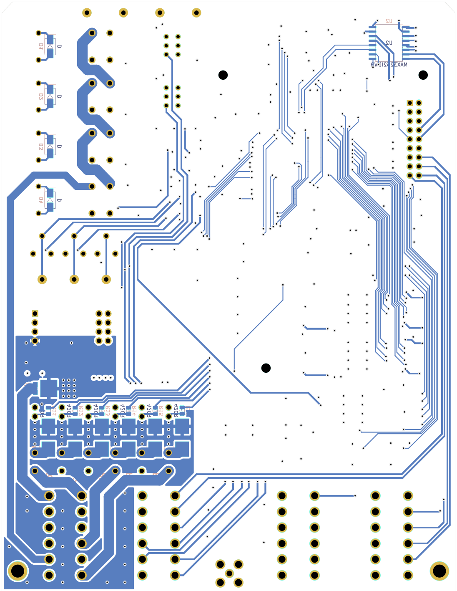

ECU Hardware Overview
=====================

<!-- TOC -->
1. [Top Level System](#Top-Level-System)
1. [ECU Housing With Loom Connections](#ECU-Housing-With-Loom-Connections)
1. [Detailed Block Diagram](#Detailed-Block-Diagram)
1. [PCBA](#PCBA)
1. [ECU Housing](#ECU-Housing)
1. [PCB Fab](#PCB-Fab)
1. [Schematic](#Schematic)
1. [PCB Layout](#PCB-Layout)
1. [ECU External Pinout](#ECU-External-Pinout)
1. [Internal Microcontroller Pinout](#Internal-Microcontroller-Pinout)
<!-- END_TOC -->

<h1 id="Top-Level-System">Top Level System</h1>

<h1 id="ECU-Housing-With-Loom-Connections">ECU Housing With Loom Connections</h1>

<h1 id="Detailed-Block-Diagram">Detailed Block Diagram</h1>

<h1 id="PCBA">PCBA</h1>

  
  

<h1 id="ECU-Housing">ECU Housing</h1>

  
  

<h1 id="PCB-Fab">PCB Fab</h1>

Non-assembled PCBs.

<h1 id="Schematic">Schematic</h1>

View [ECU_Schematic_Print.pdf](ECU_Schematic_Print.pdf) for the schematic PDF print.

<h1 id="PCB-Layout">PCB Layout</h1>

The PCB is laid out in 4 layers:

1. Components and signal routing
2. Ground
3. 3V3
4. Signal routing

| Combined | Layer 1 | Layer 2 | Layer 3 | Layer 4 |
| -------- | ------- | ------- | ------- | ------- |
|  |  |  |  |  |

<h1 id="ECU-External-Pinout">ECU External Pinout</h1>

| External Pin | Description | Signal Type| Firmware Usage |
| ------------ | ----------- | ---------- | ------------------- |
| A1 | Power output Ch 1 | Power Out (24V) | Power channel control - Unused, Spare sensor rear |
| A2 | Power output Ch 2 | Power Out (24V) | Power channel control - Wheel speed sensor rear|
| A3 | Power output Ch 3 | Power Out (24V) | Power channel control - Inverter |
| A4 | Power output Ch 4 | Power Out (24V) | Power channel control - BMS |
| A5 | Power output Ch 5 | Power Out (24V) | Power channel control - Spare sensor front, wheel speed sensor front |
| A6 | Power output Ch 6 | Power Out (24V) | Power channel control - Dashboard |
| A7 | Shutdown circuit (SDC) Reset | DIN (5V) |  |
| A8 | SDC Out | DOUT (24V) | Vehicle state machine - fault monitoring |
| A9 | Power output (5V) Ch 1 | Power Out (5V) |  |
| A10 | Power output (5V) Ch 2 | Power Out (5V) |  |
| A11 | Ground | Ground |  |
| A12 | LV Battery +24V | Power In (24V) |  |
| B1 | Ground | Ground |  |
| B2 | RS232 TX | Out (RS232) | PC Interface |
| B3 | RS232 RX | In (RS232) | PC Interface |
| B4 | Internal spare 1 | * |  |
| B5 | Programming mode | DIN (5V) | PC Interface (firmware updates) |
| B6 | Configurable IO 5V 1 (MPIO1) | DIO/AIN (5V) | Unused, Spare sensor rear |
| B7 | Configurable IO 5V 2 (MPIO2) | DIO/AIN (5V) | Unused, Spare sensor rear |
| B8 | Configurable IO 5V 3 (MPIO3) | DIO/AIN (5V) | Unused, Spare sensor rear |
| B9 | Configurable IO 5V 4 (MPIO4) | DIO/AIN (5V) | Unused, Spare sensor rear |
| B10 | Configurable IO 5V 5 (MPIO5) | DIO/AIN (5V) | Unused, Spare sensor front |
| B11 | Configurable IO 5V 6 (MPIO6) | DIO/AIN (5V) | Unused, Spare sensor front |
| B12 | Configurable IO 5V 7 (MPIO7) | DIO/AIN (5V) | Unused, Spare sensor front |
| C1 | Internal spare 2 | * |  |
| C2 | Internal spare 3 | * |  |
| C3 | CAN0 L | CAN L | Inverter CAN bus (Cascadia motion CAN message protocol) |
| C4 | CAN0 H | CAN H | Inverter CAN bus (Cascadia motion CAN message protocol) |
| C5 | CAN1 L | CAN L | BMS (custom Orion BMS CAN configuration) |
| C6 | CAN1 H | CAN H | BMS (custom Orion BMS CAN configuration) |
| C7 | Ground (CAN bus shielding) | Ground |  |
| C8 | CAN2 H | CAN H | Unused, provisioned for dashboard |
| C9 | CAN2 L | CAN L | Unused, provisioned for dashboard |
| C10 | Battery current sensor for BSPD | AIN (5V) |  |
| C11 | BMS Error | DIN (24V) | Vehicle state machine - fault monitoring |
| C12 | Insulation Monitoring Device (IMD) Error | DIN (24V) | Vehicle state machine - fault monitoring |
| D1 | Configurable IO 5V 8 (MPIO8) | DIO/AIN (5V) | Unused, Spare sensor front |
| D2 | Hall effect sensor | DIN (24V) | Wheel speed (rear) hall effect sensor |
| D3 | Hall effect sensor | DIN (24V) | Wheel speed (front) hall effect sensor |
| D4 | Inverter Error | DIN (24V) | Vehicle state machine - fault monitoring |
| D5 | Start button | DIN (24V) | Vehicle state machine - start button |
| D6 | Output LED | 1kOhm BJT sink for LED | Vehicle state machine - state indicator |
| D7 | Ground | Ground |  |
| D8 | Ground | Ground |  |
| D9 | Analog sensor | AIN (5V) | Thottle sensor B |
| D10 | Analog sensor | AIN (5V) | Thottle sensor A |
| D11 | Analog sensor | AIN (5V) | Brake pressure (rear) sensor |
| D12 | Analog sensor | AIN (5V) | Brake pressure (front) sensor |

<h1 id="Internal-Microcontroller-Pinout">Internal Microcontroller Pinout</h1>

Pin assignments for the internal STM32F7 microcontroller

